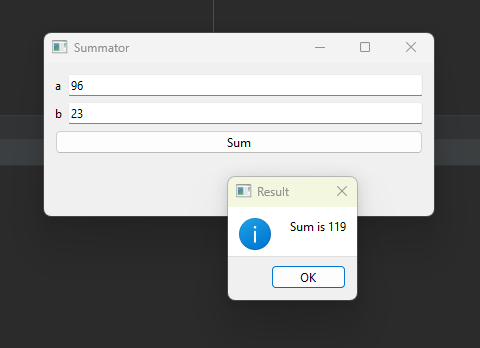

#### Тестовое задание на программирование простейшей логики

Выполняется на собеседовании в режиме реального времени (потому что слишком простое).

Дан `json` следующего вида

```json
{
    "check": {
        "val_list": [
            {
				"строка1": число1
            },
            {
				"строка2": число2
            },
			...          
        ]
    },
    "second": {
        "test": [
            число1, число2, ...
        ]
    }
}
```

Поля относящиеся к формату данных: check, val_list, second, test. Остальное - данные. По входным числам из массива second.test сформировать список ключей параметров, которые соответствуют значениям (данные внутри check.val_list). Одному значению может соответствовать несколько ключей.

Пример данных:

```json
{
    "check": {
        "val_list": [
            {
                "key1": 1
            },
            {
                "key2": 2
            },
            {
                "abc": 10
            },
            {
                "x": 7
            },
            {
                "www": 10
            }
        ]
    },
    "second": {
        "test": [
            10, 2, 7
        ]
    }
}
```

Для данного набора нужно получить: "abc", "www", "key2", "x".


#### Тестовое задание на базовое представление об ООП

Выполняется на собеседовании в режиме реального времени.

Продемонстрировать знания ООП написав класс сложения (с возможностью расширения на другие действия: вычитание, умножение и т. д.) двух чисел. 

1. Написать программный интерфейс, который позволяет одним методом задать значения. Другим методом выполнить арифметическое действие.

2. Написать классы реализации этого интерфейса для сложения и умножения. Кроме интерфейса введете базовый класс?

3. Написать класс, который обрабатывает значения из входного массива (каждый элемент массива это значение (x, y)) с помощью объекта арифметического класса и выводит на экран.

4. Что можно сделать для того, чтобы можно было не только выводить результат на экран, но и сохранять в файл (в контексте использования практик ООП)? . Как доработаете программу в этом случае?

   

#### Тестовое задание на простейшее Qt

##### Задание

Выполняется на собеседовании в режиме реального времени (потому что слишком простое)

Создать на Qt форму, которая позволяет сложить 2 числа. Должна быть кнопка при нажатии на которую появляется окно с результатом.

Как может выглядеть (один из вариантов исполнения):



##### Интерпретация и дополнительные вопросы

Как сделать рефакторинг, если будет более сложная логика чем сложение? (Если, конечно, кандидат не написал сразу отдельный класс для логики)

Посмотреть, пишет ли вручную формочки, или использует QtCreator, QtDesigner, или другие подобные инструменты. Попросить задать имена графическим компонентам, если этого не делает. Если не использует инструмент создания формочек, то умеет ли?

